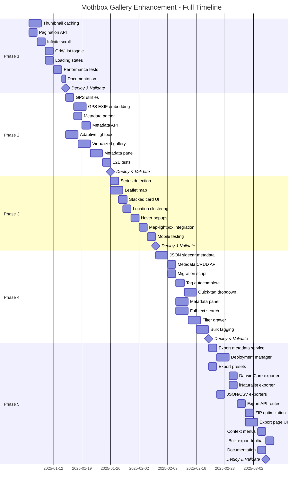
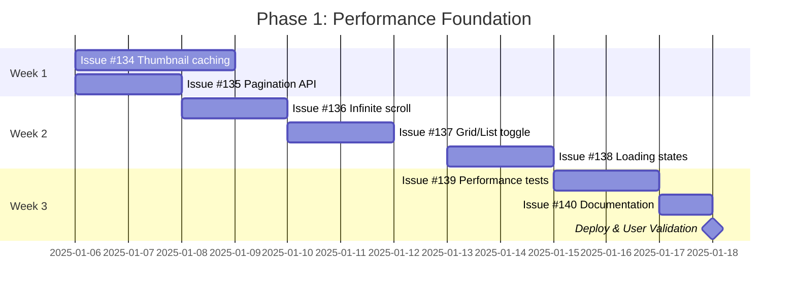
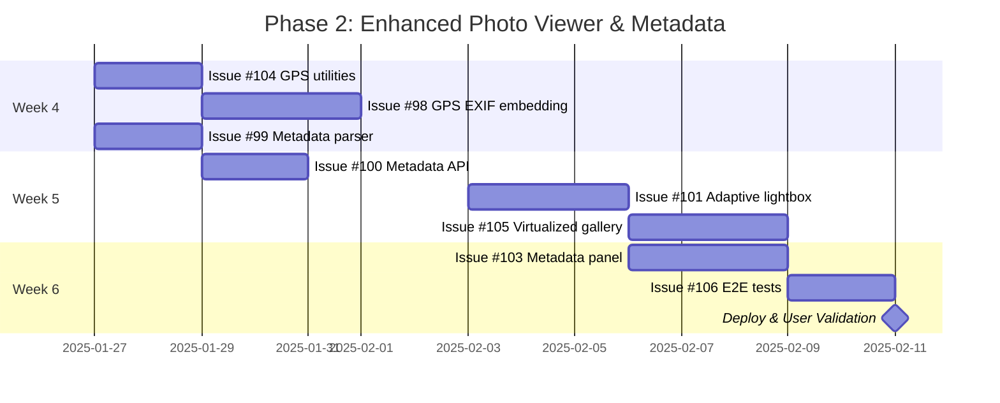
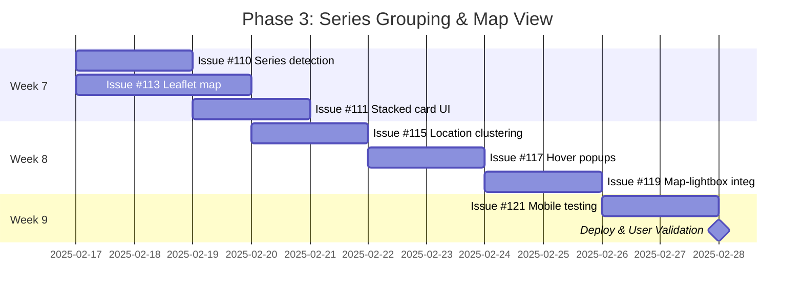
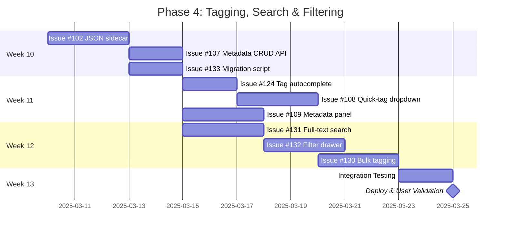
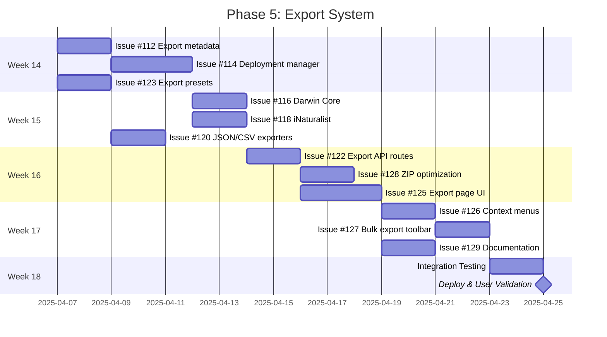
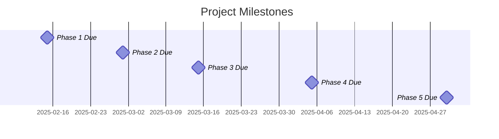

# Gallery Enhancement Timeline - Gantt Chart

This document provides visual timeline representations for the Gallery Enhancement project.

## Overall Project Timeline (20 weeks)



## Phase-by-Phase Breakdown

### Phase 1: Performance Foundation (Weeks 1-3)



**Parallel Work Opportunities**:
- #134 and #135 can both start Week 1 (backend focus)
- #138 can integrate with #136-137 (loading states layer)

---

### Phase 2: Enhanced Photo Viewer & Metadata (Weeks 4-6)



**Critical Path**: #104 → #98 → #99 → #100 → #103
**Parallel**: #101 and #105 can work independently

---

### Phase 3: Series Grouping & Map View (Weeks 7-9)



**Parallel Work Opportunities**:
- #110 and #113 can both start Week 7 (different tech stacks)

---

### Phase 4: Tagging, Search & Filtering (Weeks 10-13)



**Critical Path**: #102 → #107 → everything else depends on this
**Parallel**: After #107, multiple UI components can be built concurrently

---

### Phase 5: Export System (Weeks 14-18)



**Parallel Work Opportunities**:
- #116, #118, #120 (exporters) can all work after #112-114 complete
- #126, #127, #129 can all work in Week 17

---

## Milestone Due Dates



---

## Critical Path Analysis

The **critical path** (longest dependency chain) through the project:

```
Phase 1: #134 → #135 → #136 → #137 → #139 → #140
Phase 2: #104 → #98/#99 → #100 → #103 → #106
Phase 3: #113 → #115 → #117 → #119 → #121
Phase 4: #102 → #107 → #131 → #132
Phase 5: #112 → #114 → #116 → #122 → #125 → #126 → #127
```

**Total Critical Path Duration**: ~88 days (17.6 weeks)

With full-time capacity (30-40 hours/week) and allowing for:
- User validation after each phase (1-2 days)
- Buffer for unexpected issues (10%)
- Documentation and polish time

**Realistic Timeline**: 18-20 weeks (4.5-5 months)

---

## Resource Allocation (Solo Developer)

### Typical Week Breakdown

```
Monday-Wednesday:     Feature development (20-24 hours)
Thursday:             Testing & bug fixes (8 hours)
Friday:               Code review, documentation, planning (8 hours)
```

### Effort Distribution by Phase

| Phase | Backend | Frontend | Testing | Docs | Total |
|-------|---------|----------|---------|------|-------|
| Phase 1 | 7 days | 4 days | 2 days | 1 day | 14 days |
| Phase 2 | 9 days | 8 days | 2 days | 1 day | 20 days |
| Phase 3 | 6 days | 7 days | 2 days | 0 days | 15 days |
| Phase 4 | 8 days | 11 days | 2 days | 1 day | 22 days |
| Phase 5 | 13 days | 7 days | 2 days | 2 days | 24 days |
| **Total** | **43 days** | **37 days** | **10 days** | **5 days** | **95 days** |

---

## Viewing This Chart

To render these Mermaid diagrams:
1. View this file on GitHub (renders automatically)
2. Use VS Code with Mermaid extension
3. Copy to https://mermaid.live for standalone viewing
4. Use GitHub Project timeline view for interactive planning

---

**Last Updated**: 2025-01-06
**Version**: 1.0
