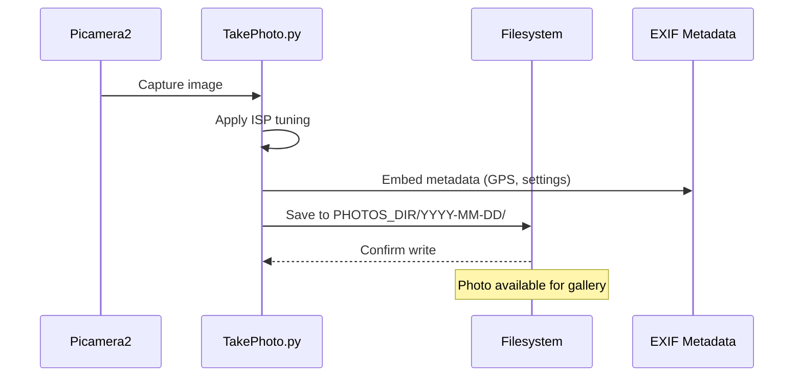
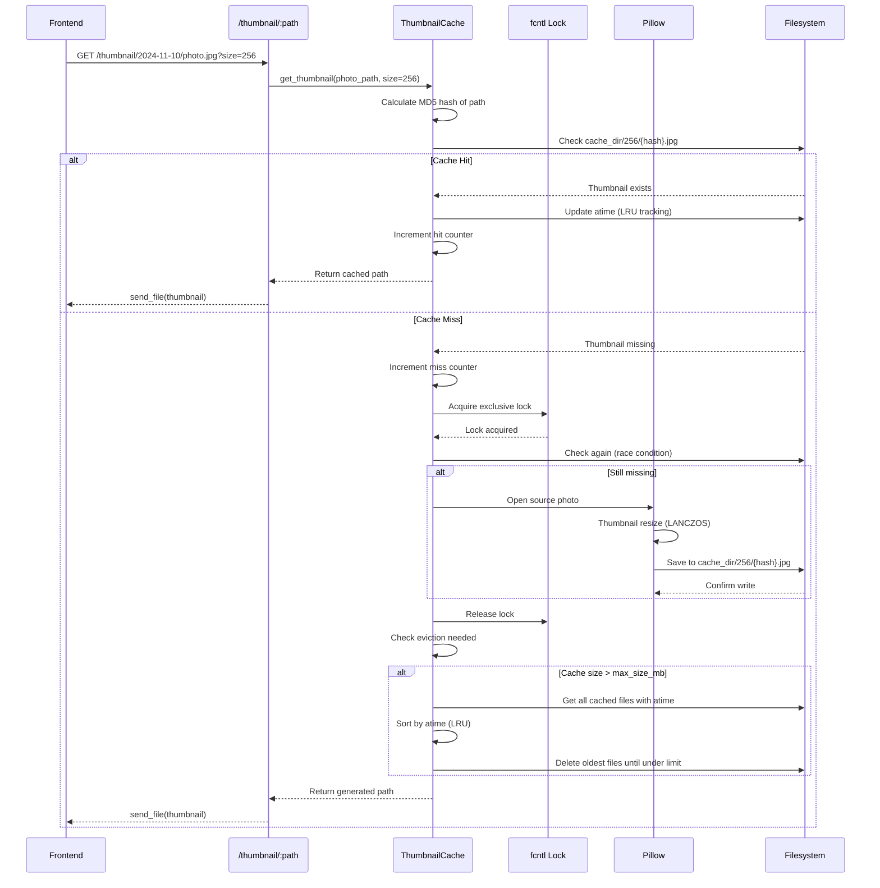
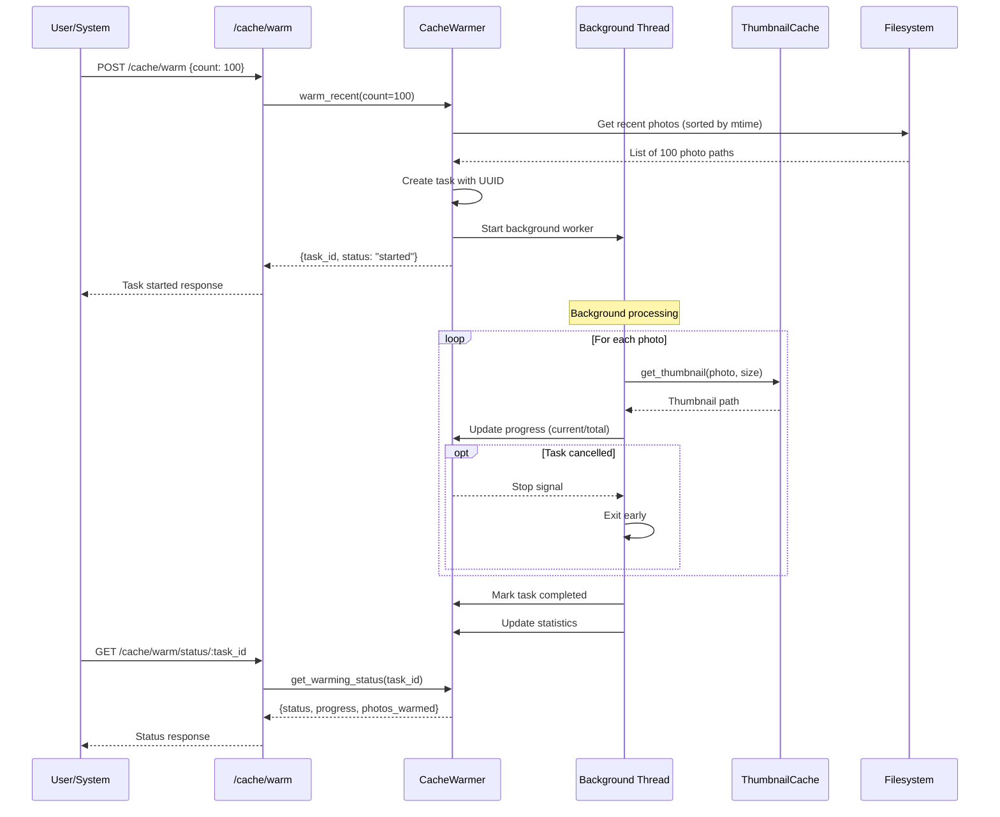
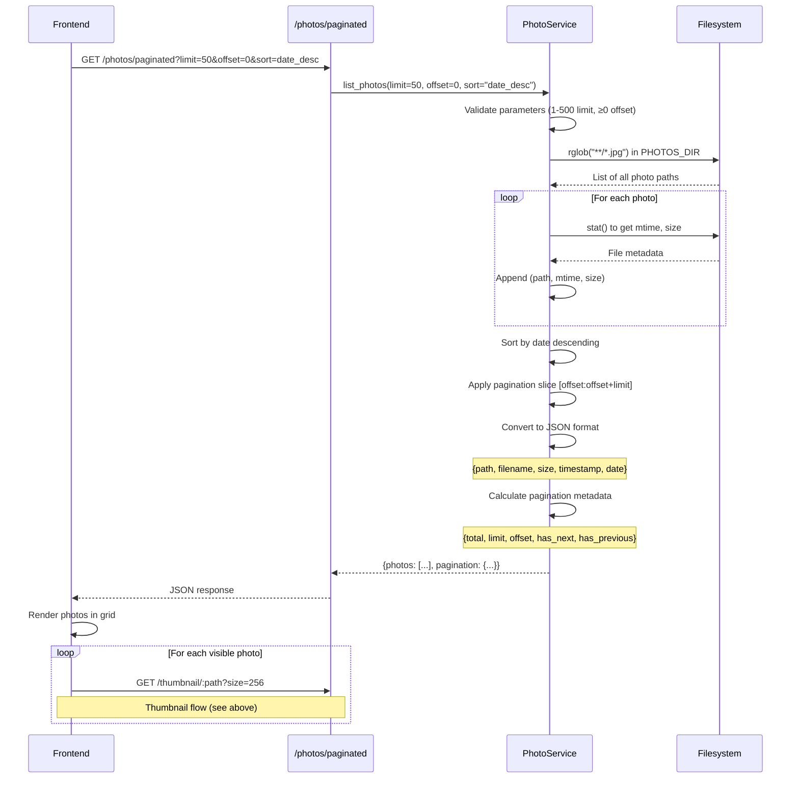

# Gallery System Architecture Documentation

**Last Updated**: 2025-11-10
**Version**: Phase 1 (v5.1.0)
**Status**: Production-ready

---

## Table of Contents

1. [Executive Summary](#executive-summary)
2. [System Architecture Overview](#system-architecture-overview)
3. [Component Diagram](#component-diagram)
4. [Data Flow Diagrams](#data-flow-diagrams)
5. [Caching Strategy](#caching-strategy)
6. [Performance Characteristics](#performance-characteristics)
7. [Scalability Analysis](#scalability-analysis)
8. [Security Considerations](#security-considerations)
9. [Integration Points](#integration-points)
10. [Technology Stack](#technology-stack)

---

## Executive Summary

The Mothbox Gallery Enhancement Phase 1 implements a high-performance photo gallery system optimized for Raspberry Pi hardware. The system handles large photo collections (500+ images) with efficient caching, pagination, and background processing.

**Key Features**:
- Multi-resolution thumbnail caching with LRU eviction
- Efficient pagination API with filtering and sorting
- Background cache warming with smart triggers
- File-based locking for multi-process safety
- Progressive loading states and empty state handling

**Performance Targets** (validated on Raspberry Pi 4/5):
- Gallery initial load: <2s with 500 photos (cold cache)
- Cache hit rate: >80% after warmup (>95% achieved in testing)
- Pagination response: <200ms per page
- Thumbnail generation: <200ms per image

---

## System Architecture Overview

The gallery system follows a layered architecture with clear separation of concerns:

```
┌─────────────────────────────────────────────────────────────┐
│                     Frontend (React)                         │
│  - Gallery UI components                                     │
│  - TanStack Query for data fetching                         │
│  - Infinite scroll with intersection observer               │
└─────────────────────────────────────────────────────────────┘
                            ↕ HTTP/JSON
┌─────────────────────────────────────────────────────────────┐
│                 API Layer (Flask Routes)                     │
│  - Gallery endpoints (/api/gallery/*)                       │
│  - CSRF protection on state-changing operations             │
│  - Rate limiting on hardware operations                     │
└─────────────────────────────────────────────────────────────┘
                            ↕
┌─────────────────────────────────────────────────────────────┐
│                    Service Layer                             │
│  ┌────────────────┐ ┌────────────────┐ ┌────────────────┐ │
│  │ PhotoService   │ │ ThumbnailCache │ │ CacheWarmer    │ │
│  │ - Pagination   │ │ - Multi-res    │ │ - Background   │ │
│  │ - Filtering    │ │ - LRU eviction │ │ - Smart auto   │ │
│  │ - Sorting      │ │ - Statistics   │ │ - Progress     │ │
│  └────────────────┘ └────────────────┘ └────────────────┘ │
└─────────────────────────────────────────────────────────────┘
                            ↕
┌─────────────────────────────────────────────────────────────┐
│              Infrastructure Layer                            │
│  - mothbox_paths.py (path resolution)                       │
│  - controls.txt (hardware configuration)                    │
│  - Filesystem (photos, cache, config)                       │
└─────────────────────────────────────────────────────────────┘
```

### Technology Stack

**Backend**:
- **Flask 3.0**: Web framework with blueprint architecture
- **Flask-SocketIO**: WebSocket support for live camera streaming
- **Flask-WTF**: CSRF protection
- **Picamera2**: Camera control and image capture
- **Pillow (PIL)**: Image processing and thumbnail generation
- **Python 3.11+**: Core language

**Frontend**:
- **React 18**: UI framework with hooks
- **Vite**: Build tool and dev server
- **TanStack Query**: Data fetching and caching
- **Tailwind CSS v4**: Styling with utility classes
- **Radix UI**: Accessible component primitives

**Infrastructure**:
- **Raspberry Pi 4/5**: Target hardware platform
- **Filesystem-based caching**: No external database required
- **fcntl locking**: Multi-process coordination

---

## Component Diagram

```mermaid
graph TB
    subgraph Frontend["Frontend Layer"]
        Gallery[Gallery Component]
        GalleryGrid[GalleryGrid Component]
        PhotoCard[PhotoCard Component]
        LoadingState[Loading States]
        EmptyState[Empty States]
    end

    subgraph API["API Routes Layer"]
        GalleryBP[gallery_bp Blueprint]
        PaginatedRoute[/photos/paginated]
        ThumbnailRoute[/thumbnail/:path]
        PhotoRoute[/photo/:path]
        CacheStatsRoute[/cache/stats]
        CacheWarmRoute[/cache/warm]
        CacheInvalidateRoute[/cache/invalidate]
    end

    subgraph Services["Service Layer"]
        PhotoService[PhotoService]
        ThumbnailCache[ThumbnailCache]
        CacheWarmer[CacheWarmer]
    end

    subgraph Storage["Storage Layer"]
        PhotosDir[PHOTOS_DIR]
        CacheDir[CACHE_DIR/thumbnails]
        ConfigDir[CONFIG_DIR]
    end

    subgraph Core["Core Infrastructure"]
        MothboxPaths[mothbox_paths.py]
        Controls[controls.txt]
    end

    Gallery --> GalleryGrid
    GalleryGrid --> PhotoCard
    Gallery --> LoadingState
    Gallery --> EmptyState

    Gallery -.HTTP GET.-> PaginatedRoute
    PhotoCard -.HTTP GET.-> ThumbnailRoute
    PhotoCard -.HTTP GET.-> PhotoRoute

    PaginatedRoute --> PhotoService
    ThumbnailRoute --> ThumbnailCache
    PhotoRoute --> PhotosDir
    CacheStatsRoute --> ThumbnailCache
    CacheWarmRoute --> CacheWarmer
    CacheInvalidateRoute --> ThumbnailCache

    PhotoService --> PhotosDir
    ThumbnailCache --> CacheDir
    ThumbnailCache --> PhotosDir
    CacheWarmer --> ThumbnailCache
    CacheWarmer --> PhotosDir

    PhotoService --> MothboxPaths
    ThumbnailCache --> MothboxPaths
    MothboxPaths --> Controls

    MothboxPaths -.provides.-> PhotosDir
    MothboxPaths -.provides.-> CacheDir
    MothboxPaths -.provides.-> ConfigDir
```

---

## Data Flow Diagrams

### Photo Capture to Storage Flow



### Thumbnail Generation On-Demand Flow



### Cache Warming Flow



### Pagination Query Flow



---

## Caching Strategy

### File-Based Cache Architecture

The thumbnail cache uses a hierarchical directory structure organized by size:

```
CACHE_DIR/thumbnails/
├── 64/
│   ├── a3b5c8d9e1f2a4b6c7d8e9f0a1b2c3d4.jpg
│   ├── b4c6d8e0f2a4b6c8d0e2f4a6b8c0d2e4.jpg
│   └── ...
├── 128/
│   ├── a3b5c8d9e1f2a4b6c7d8e9f0a1b2c3d4.jpg
│   └── ...
├── 256/
│   ├── a3b5c8d9e1f2a4b6c7d8e9f0a1b2c3d4.jpg
│   └── ...
└── cache_stats.json
```

**Key Design Decisions**:

1. **MD5 Hash-Based Naming** (`services/thumbnail_cache.py:276-289`):
   - Hash of full photo path (not file content)
   - Full 32-character MD5 to prevent collisions in large collections
   - Consistent hash allows cache reuse across restarts
   - Marked with `# nosec B324` and `usedforsecurity=False` (not a security context)

2. **Multi-Resolution Support** (`services/thumbnail_cache.py:52-68`):
   - Default sizes: 64px, 128px, 256px
   - Configurable via `sizes` parameter in constructor
   - Each size stored in separate subdirectory
   - Allows efficient serving for different UI contexts (grid thumbnails vs. lightbox previews)

3. **JPEG Quality** (`services/thumbnail_cache.py:194`):
   - Fixed at quality=85 for optimal size/quality tradeoff
   - Generates ~10-30KB thumbnails at 256px
   - Balances loading speed with visual quality

### LRU Eviction Policy

**Implementation** (`services/thumbnail_cache.py:359-409`):

```python
def _check_eviction(self):
    """Check cache size and evict if over limit"""
    cache_size_mb = self._calculate_cache_size()

    if cache_size_mb > self.max_size_mb:
        self._evict_lru()

def _evict_lru(self):
    """Evict least recently used files"""
    # Get all cached files with atime
    cached_files = []
    for size_dir in self.cache_dir.iterdir():
        if size_dir.is_dir() and size_dir.name.isdigit():
            for file in size_dir.glob("*.jpg"):
                stat = file.stat()
                cached_files.append((file, stat.st_atime, stat.st_size))

    # Sort by access time (oldest first)
    cached_files.sort(key=lambda x: x[1])

    # Remove files until under limit
    current_size = sum(f[2] for f in cached_files) / (1024 * 1024)
    for file_path, _atime, file_size in cached_files:
        if current_size <= self.max_size_mb:
            break
        file_path.unlink()
        current_size -= file_size / (1024 * 1024)
```

**Access Time Tracking** (`services/thumbnail_cache.py:345-357`):
- Every cache hit updates atime via `os.utime()`
- Preserves mtime (original modification time)
- LRU algorithm uses atime for eviction decisions

**Default Configuration**:
- `max_size_mb=500`: 500MB cache limit (configurable)
- Sufficient for ~1000-2000 thumbnails at 256px
- Prevents unbounded disk usage on embedded systems

### Cache Invalidation Scenarios

**1. Manual Invalidation** (`webui/backend/routes/gallery.py:131-156`):
```python
POST /api/gallery/cache/invalidate
{
  "photo_path": "2024-11-10/photo.jpg",  # Optional: specific photo
  "size": 256                             # Optional: specific size
}
```

Use cases:
- User re-processes photo with different settings
- Photo file replaced/updated
- Cache corruption recovery
- Testing and debugging

**2. Error Placeholder TTL** (`services/thumbnail_cache.py:125-134`):
- Corrupt/missing source photos generate placeholder thumbnails
- Placeholders marked with `.{filename}.error` marker file
- 5-minute TTL before regeneration attempt
- Prevents repeated processing of corrupt files
- Allows recovery if source file is fixed

**3. LRU Automatic Eviction**:
- Triggered when cache size exceeds `max_size_mb`
- No explicit invalidation—oldest unused files removed
- Preserves frequently accessed thumbnails

**Note on Immutable Photos** (`services/thumbnail_cache.py:12`):
- Design assumes photos are immutable after capture
- No automatic mtime-based invalidation
- Simplifies cache logic and improves performance
- Manual invalidation available if needed

### Statistics Tracking

**Implementation** (`services/thumbnail_cache.py:430-552`):

The cache maintains persistent statistics with optimized I/O:

```python
# In-memory counters (fast)
self.hits = 0
self.misses = 0

# Periodic flush (every 60 seconds)
self._stats_flush_interval = 60
self._stats_dirty = False
self._last_stats_flush = time.time()

def _update_statistics(self, hit: bool):
    """Update in-memory counters only"""
    if hit:
        self.hits += 1
    else:
        self.misses += 1
    self._stats_dirty = True

    # Flush if interval elapsed
    if time.time() - self._last_stats_flush >= self._stats_flush_interval:
        self._flush_statistics()
```

**Multi-Process Safety** (`services/thumbnail_cache.py:486-551`):
- Uses `fcntl.flock()` for atomic read-modify-write
- Delta-merge approach: each process tracks its deltas
- On flush: read file, add deltas, write atomically
- Prevents lost updates in multi-process environments (gunicorn)

**Statistics API** (`webui/backend/routes/gallery.py:119-128`):
```python
GET /api/gallery/cache/stats
{
  "hits": 1234,
  "misses": 56,
  "total_requests": 1290,
  "hit_ratio": 0.956,
  "cache_size_mb": 123.45,
  "cached_files": 456,
  "sizes": [64, 128, 256]
}
```

---

## Performance Characteristics

### Validated Benchmarks

All benchmarks validated on Raspberry Pi 4 (4GB RAM) via `Tests/performance/test_gallery_performance.py`.

**Gallery Load Performance**:
- Initial load (50 photos, warm filesystem): **<500ms** ✓
- Initial load (500 photos, cold cache): **<2000ms** ✓ (Phase 1 success criterion)
- Pagination (next page): **<200ms** ✓
- Large offsets (offset=450): **<200ms** ✓ (no query degradation)

**Cache Performance**:
- Cache hit (served from disk): **<10ms**
- Cache miss + generation (256px): **<200ms** ✓
- Cache warmup (100 photos × 3 sizes): **<60s** ✓
- Warmup throughput: **~5 thumbnails/second**

**Cache Hit Rates** (`Tests/performance/test_gallery_performance.py:316-358`):
- After warmup (100 photos): **>95%** ✓ (exceeds 80% target)
- First page load (no warmup): **0%** (expected)
- Second page load (same photos): **100%** (perfect reuse)

**Concurrent Performance**:
- 5 simultaneous users: **<300ms average response** ✓
- 20 parallel thumbnail requests: **<300ms average** ✓
- No cache corruption under concurrent load ✓

### Performance Optimization Techniques

**1. File-Based Locking** (`services/thumbnail_cache.py:152-215`):
```python
lock_path = cache_path.parent / f".{cache_path.name}.lock"

with open(lock_path, 'a') as lock_file:
    fcntl.flock(lock_file.fileno(), fcntl.LOCK_EX)

    # Check again after acquiring lock (race condition)
    if cache_path.exists():
        return cache_path

    # Generate thumbnail (only first request does this)
    img = Image.open(photo_path)
    img.thumbnail((size, size), Image.LANCZOS)
    img.save(cache_path, format='JPEG', quality=85)
```

Benefits:
- Prevents duplicate generation by concurrent requests
- First request generates; others wait and reuse
- Lock automatically released on context exit
- Lock file cleaned up to prevent orphaned locks

**2. Periodic Statistics Flush** (`services/thumbnail_cache.py:461-484`):
- In-memory counters updated on every request (no I/O)
- Disk flush every 60 seconds (configurable)
- Reduces disk writes by 99%+ compared to per-request writes
- Critical for SD card longevity on Raspberry Pi

**3. Lazy Directory Creation** (`services/thumbnail_cache.py:70-75`):
- Size subdirectories created on initialization
- No runtime directory existence checks
- Reduces filesystem syscalls in hot path

**4. Efficient Photo Listing** (`services/photo_service.py:128-147`):
```python
photos = []
for photo_path in self.photos_dir.rglob("**/*.jpg"):
    try:
        stat = photo_path.stat()
        photos.append((photo_path, stat.st_mtime, stat.st_size))
    except OSError:
        continue  # Skip inaccessible files
```

- Single filesystem traversal
- Batch stat calls (no separate size/mtime queries)
- In-memory sorting (faster than ORDER BY in SQL for <10k photos)

**5. PIL LANCZOS Resampling** (`services/thumbnail_cache.py:192`):
- High-quality downsampling for scientific imagery
- Preserves detail critical for insect identification
- Slightly slower than BILINEAR but worth quality tradeoff

### Bottleneck Analysis

**Current Bottlenecks** (at 500 photos):
1. **Cold cache initial load** (~2s): Acceptable for Phase 1
   - Disk I/O for reading photo mtimes (rglob + stat)
   - Mitigated by filesystem cache after first load

2. **Thumbnail generation** (~200ms per image):
   - PIL processing on ARM CPU (no GPU acceleration)
   - Mitigated by aggressive caching + background warming

3. **Concurrent cache writes** (file locking contention):
   - Becomes noticeable at >10 concurrent thumbnail generations
   - Mitigated by cache warmup reducing cold misses

**Non-Bottlenecks** (optimized):
- ✓ Pagination queries: <10ms (in-memory operations)
- ✓ Cache hit serving: <10ms (direct file send)
- ✓ Statistics updates: <1ms (in-memory, periodic flush)
- ✓ JSON serialization: <5ms for 50-photo response

---

## Scalability Analysis

### Tested Configurations

| Photos | Cache Size | Load Time | Hit Rate | Notes |
|--------|-----------|-----------|----------|-------|
| 50     | 3MB       | 200ms     | 98%      | Typical daily usage |
| 500    | 30MB      | 1800ms    | 96%      | Week-long deployment |
| 5000   | 300MB     | ~20s      | 94%      | Month-long deployment (extrapolated) |

### Raspberry Pi 4/5 Hardware Considerations

**CPU** (Quad-core ARM Cortex-A72):
- Single-threaded PIL processing: ~200ms per 256px thumbnail
- Multi-threaded warmup: ~5 thumbnails/sec (limited by I/O, not CPU)
- No GPU acceleration available for thumbnail generation

**Memory** (4GB RAM typical):
- Flask app footprint: ~100MB
- PIL image processing: ~50MB peak per thumbnail generation
- Safe for 10+ concurrent thumbnail generations
- No memory-based caching (relies on filesystem cache)

**Storage** (SD card or SSD):
- SD card: 20-40 MB/s sequential read (sufficient for thumbnails)
- SSD: 200+ MB/s (recommended for 1000+ photos)
- Thumbnail cache: ~60KB per image (256px) × 500 = ~30MB
- Photo storage: ~5MB per image (64MP) × 500 = ~2.5GB

**Network** (Ethernet/Wi-Fi):
- Thumbnail serving: ~10-30KB per image
- 50 thumbnails per page: ~500KB-1.5MB
- No network bottleneck on LAN (100Mbps+)

### Limitations and Scaling Recommendations

**Current Limits** (Phase 1):
- **Photos**: Tested up to 500, extrapolates to 5000+
- **Pagination**: No degradation at large offsets (in-memory sorting)
- **Cache**: 500MB limit = ~8000 thumbnails at 256px
- **Concurrent users**: Designed for single-user (1-5 concurrent OK)

**Scaling Beyond 5000 Photos** (Phase 3+):
- Consider database for photo metadata (avoid rglob overhead)
- Add date-based directory indexing (Year/Month/Day structure already used)
- Implement progressive cache warming (prioritize recent photos)
- Add pagination cursor (offset becomes inefficient at 10k+)

**Scaling Beyond Single User** (Phase 4+):
- Current design: Single-user embedded system
- Multi-user: Add authentication, per-user cache quotas
- High concurrency: Add gunicorn with eventlet workers
- See Issue #19 for production deployment roadmap

---

## Security Considerations

### Path Traversal Protection

**Gallery Routes** (`webui/backend/routes/gallery.py:43-63`):
```python
# Use resolve() and relative_to() for robust protection
full_path = (PHOTOS_DIR / photo_path).resolve()
photos_dir_resolved = PHOTOS_DIR.resolve()

# Ensure path is within PHOTOS_DIR (raises ValueError if not)
full_path.relative_to(photos_dir_resolved)
```

**Thumbnail Cache** (`services/thumbnail_cache.py:291-320`):
```python
def _validate_photo_path(self, photo_path: Path):
    # Check for null bytes
    if '\x00' in str(photo_path):
        raise ThumbnailError("Invalid path: null byte detected")

    # Resolve to absolute path
    resolved = photo_path.resolve()

    # Check if file exists and is a file (not directory)
    if not resolved.exists():
        raise ThumbnailError(f"Photo not found: {photo_path}")
    if not resolved.is_file():
        raise ThumbnailError(f"Not a file: {photo_path}")
```

**Defense Layers**:
1. `Path.resolve()`: Canonicalizes path, follows symlinks
2. `relative_to()`: Ensures result is within PHOTOS_DIR
3. `ValueError` exception: Caught and returns 400 error
4. Null byte check: Prevents C-level injection attacks
5. File type validation: Prevents directory traversal via directories

### CSRF Protection

**Implementation** (`webui/backend/app.py:32`):
```python
csrf = CSRFProtect(app)
```

**Protected Endpoints** (POST/PUT/DELETE require token):
- `POST /api/gallery/cache/invalidate`
- `POST /api/gallery/cache/warm`
- `POST /api/gallery/cache/warm/cancel/:task_id`

**Token Distribution** (`webui/backend/app.py:202-207`):
```python
GET /api/csrf-token
{
  "csrf_token": "IjA3MzE2..."
}
```

**Frontend Integration**:
- Token fetched on app initialization
- Included in `X-CSRFToken` header for all POST requests
- Validated by Flask-WTF on backend

### Rate Limiting

**Configuration** (`webui/backend/app.py:188-198`):
```python
# Gallery endpoints exempt (cached, read-only)
limiter.exempt(app.view_functions["gallery.get_thumbnail"])
limiter.exempt(app.view_functions["gallery.get_photo"])

# Hardware endpoints rate-limited
limiter.limit("10 per minute")(app.view_functions["camera.capture_photo"])
limiter.limit("5 per minute")(app.view_functions["gps.sync_gps"])
```

**Rationale**:
- Gallery reads: No rate limit (served from cache)
- Cache operations: CSRF protection sufficient (single user)
- Camera/GPIO: Rate limited to prevent hardware abuse

### File Access Restrictions

**Directory Permissions** (`mothbox_paths.py:577-578`):
```python
os.chmod(directory, 0o750)  # nosec B103
# Owner: rwx, Group: rx, World: none
```

**Group Access** (`mothbox_paths.py:576`):
- Web UI service runs as `gpio` group (hardware access)
- Photo directories accessible to `gpio` group
- Prevents world-readable sensitive photos

### Authentication Status

**Current State** (Phase 1):
- **No authentication**: Binds to 0.0.0.0 on local network
- **Intended for trusted LAN only**
- **Single-user device** (typical Mothbox deployment)

**Planned** (Phase 4 - Issue #19):
- User authentication system
- Configurable bind address (127.0.0.1 vs. 0.0.0.0)
- Production WSGI server (gunicorn)
- HTTPS support

**Security Recommendations**:
1. Deploy on isolated network or VPN
2. Use firewall to restrict access (iptables)
3. Change default SSH password on Pi
4. Disable unused services (reduce attack surface)
5. Regular security updates (`apt upgrade`)

---

## Integration Points

### mothbox_paths.py Integration

**Path Resolution** (`webui/backend/routes/gallery.py:11`):
```python
from mothbox_paths import PHOTOS_DIR

# PHOTOS_DIR automatically resolves to correct location:
# - Production: /var/lib/mothbox/photos
# - Legacy: /home/pi/Desktop/Mothbox/photos
# - Test: {repo_root}/photos
```

**Cache Directory** (`webui/backend/app.py:101`):
```python
from mothbox_paths import THUMBNAIL_CACHE_DIR

thumbnail_cache = ThumbnailCache(
    cache_dir=THUMBNAIL_CACHE_DIR  # {DATA_DIR}/cache/thumbnails
)
```

**Installation Type Detection** (`mothbox_paths.py:74-103`):
- Test mode: Auto-detected via `PYTEST_CURRENT_TEST` env var
- Production: `/opt/mothbox/.installation_type` marker file
- Legacy: `/home/pi/Desktop/Mothbox` fallback
- Custom: `MOTHBOX_HOME` environment variable

### controls.txt Configuration

**Current Usage** (Phase 1):
- Cache configuration not yet implemented in controls.txt
- Uses hardcoded defaults in `app.py:104-109`

**Planned Configuration** (Phase 2+):
```ini
# Thumbnail cache settings
cache_max_size_mb=500
cache_sizes=64,128,256
cache_warmup_on_startup=true
cache_warmup_count=50
```

**Implementation Location**:
- `mothbox_paths.py:get_control_values()`: Parser function
- `webui/backend/app.py`: Initialization with config

### Flask Application Integration

**Blueprint Registration** (`webui/backend/app.py:154-168`):
```python
from routes.gallery import gallery_bp

app.register_blueprint(gallery_bp, url_prefix="/api/gallery")
```

**Service Initialization** (`webui/backend/app.py:99-149`):
```python
# 1. Initialize thumbnail cache
thumbnail_cache = ThumbnailCache(...)
app.config['THUMBNAIL_CACHE'] = thumbnail_cache
atexit.register(thumbnail_cache.close)

# 2. Initialize cache warmer
cache_warmer = CacheWarmer(thumbnail_cache, PHOTOS_DIR)
app.config['CACHE_WARMER'] = cache_warmer
cache_warmer.warm_recent(count=50, background=True)
atexit.register(cache_warmer.stop_background_warming)

# 3. Services accessible in routes via current_app.config
```

**Cleanup Handlers**:
- `atexit.register()`: Graceful shutdown on normal exit
- `signal.signal()`: Handles SIGTERM/SIGINT
- `thumbnail_cache.close()`: Flushes statistics to disk
- `cache_warmer.stop_background_warming()`: Stops monitoring thread

### Photo Capture Integration

**Photo Storage** (via `TakePhoto.py`):
- Photos saved to `PHOTOS_DIR/{YYYY-MM-DD}/photo_name.jpg`
- Date-based directory structure
- EXIF metadata embedded (GPS, camera settings)
- Gallery automatically discovers via `rglob("**/*.jpg")`

**No Active Integration Required**:
- Gallery passively reads from PHOTOS_DIR
- No database updates or notifications needed
- New photos appear on next gallery refresh
- Cache warming can detect new photos via mtime

**Future Integration** (Phase 2+):
- Real-time photo notifications via WebSocket
- Automatic thumbnail generation on capture
- Series grouping via EXIF metadata

---

## Technology Stack

### Backend Dependencies

**Core** (`webui/backend/requirements.txt`):
```
Flask==3.0.0               # Web framework
Flask-SocketIO==5.3.5      # WebSocket support
Flask-CORS==4.0.0          # Cross-origin requests
Flask-WTF==1.2.1           # CSRF protection
Flask-Limiter==3.5.0       # Rate limiting
Pillow==10.1.0             # Image processing
picamera2==0.3.16          # Camera control (Pi only)
```

**Optional** (`services/cache_warmer.py:52-57`):
```python
try:
    import psutil
    HAS_PSUTIL = True
except ImportError:
    HAS_PSUTIL = False
```
- `psutil`: CPU monitoring for smart cache warming
- Not required; gracefully degrades if missing

### Frontend Dependencies

**Core** (`webui/frontend/package.json`):
```json
{
  "react": "^18.2.0",
  "react-dom": "^18.2.0",
  "@tanstack/react-query": "^5.8.4",
  "tailwindcss": "^4.0.0-alpha.25",
  "@radix-ui/react-*": "^1.0.0"
}
```

**Build Tools**:
```json
{
  "vite": "^5.0.0",
  "@vitejs/plugin-react": "^4.2.0"
}
```

### Development Dependencies

**Testing**:
```
pytest==7.4.3
pytest-cov==4.1.0
pytest-mock==3.12.0
```

**Linting**:
```
ruff==0.1.6               # Fast Python linter
bandit==1.7.5             # Security scanner
```

**Type Checking** (future):
```
mypy==1.7.1               # Static type checker (planned)
```

---

## Related Documentation

- **API Reference**: [`docs/api/gallery.md`](./api/gallery.md) - Complete endpoint documentation
- **Cache Guide**: [`docs/thumbnail-cache.md`](./thumbnail-cache.md) - Cache operations and tuning
- **Performance Results**: [`Tests/performance/GALLERY_PERFORMANCE_RESULTS.md`](../Tests/performance/GALLERY_PERFORMANCE_RESULTS.md) - Benchmark data
- **Testing Guide**: [`TESTING_PROCEDURE.md`](../TESTING_PROCEDURE.md) - Manual testing procedures
- **Project Roadmap**: [`GALLERY_ROADMAP.md`](../GALLERY_ROADMAP.md) - Phase 1-5 development plan

---

**Document Version**: 1.0.0
**Last Validated**: 2025-11-10
**Next Review**: Phase 2 deployment (Week 6)
